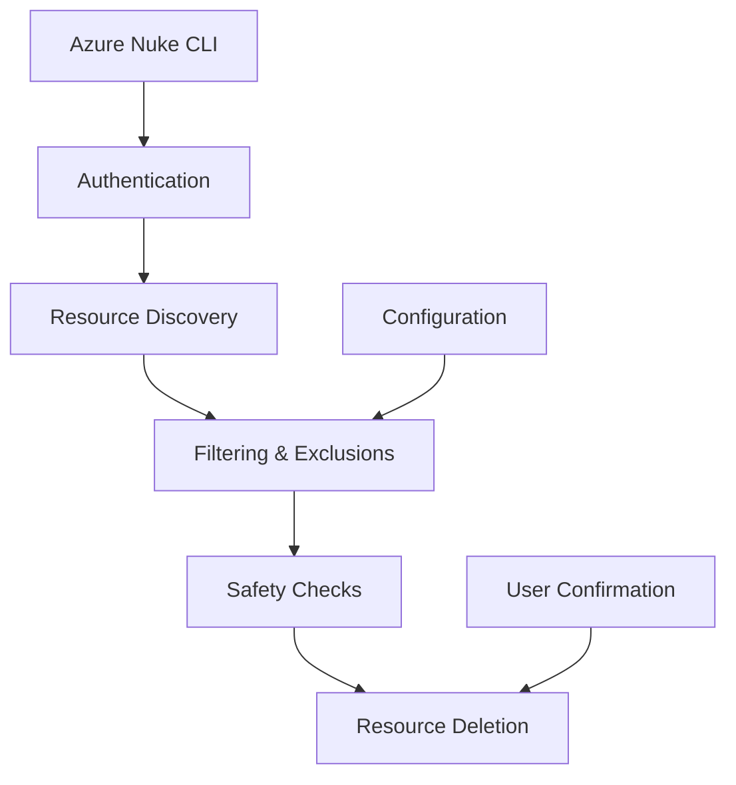

# Azure Nuke


A powerful CLI tool for scanning and cleaning up Azure resources.

## Features

- **Comprehensive scanning** of Azure resources across subscriptions
- **Safe deletion** with confirmation prompts and dry-run mode
- **Flexible filtering** by resource type, region, and more
- **Exclusion system** to protect critical infrastructure
- **Beautiful ASCII art banners** for a better command-line experience
- **Color-coded output** for easy identification of actions and results

## Quick Start

### Installation

=== "Homebrew (macOS/Linux)"

    ```bash
    brew install sojay/tap/aznuke
    ```

=== "pip"

    ```bash
    pip install aznuke
    ```

=== "Binary Download"

    Download the latest binary from [GitHub Releases](https://github.com/sojay/azure-nuke/releases)

### Basic Usage

```bash
# Scan all resources
aznuke scan

# Delete resources with confirmation
aznuke delete

# Dry run (preview only)
aznuke delete --dry-run
```

## Architecture



## Safety First

Azure Nuke is designed with safety as a priority:

- **Dry-run mode** to preview changes
- **Exclusion system** to protect critical resources
- **Confirmation prompts** before destructive actions
- **Protected subscription** support
- **Comprehensive logging** of all operations

## Next Steps

- [Installation Guide](installation.md) - Detailed installation instructions
- [Usage Guide](usage.md) - Complete command reference
- [Configuration](configuration.md) - Setup exclusions and preferences 